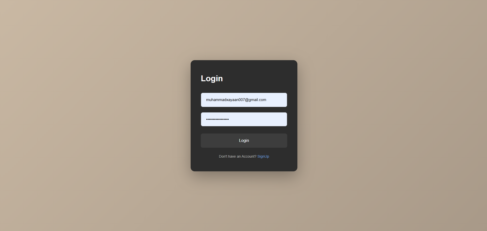
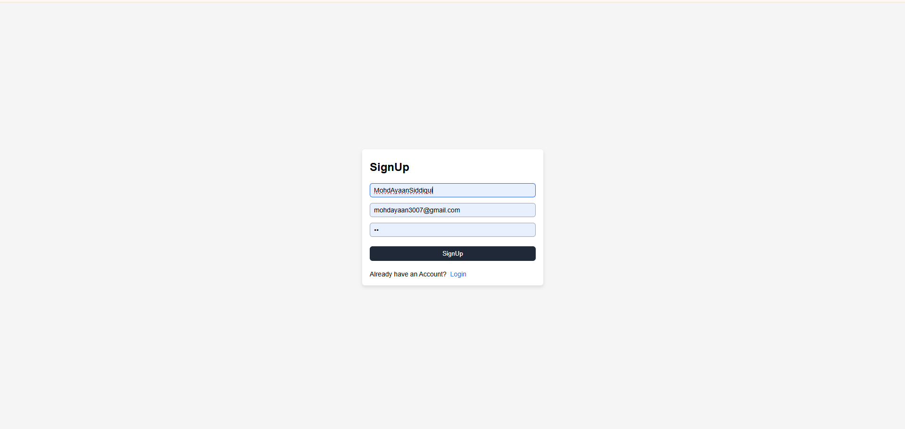

## Gmail App
A FullStack gmail Application built using MERN with Auth , inbox management , email sending functionality

### ⚙️ Front-End
- [React/Redux](https://react.dev/) – Component-based UI library  
- [Tailwind CSS ](https://tailwindcss.com/) – Utility-first CSS framework   
- [Axios](https://axios-http.com/) – Promise-based HTTP client  
- [React Hot Toast](https://react-hot-toast.com/) – Toast notification library  
- [React Icons](https://React-icons/) – Beautiful & consistent icon toolkit  
---

### ⚙️ Back-End
- [React-Hot-Toast](https://react-hot-toast.com) - A lightweight , customizable toast notification library
- [Express.js](https://expressjs.com/) – Node.js web application framework  
- [Dotenv](https://www.npmjs.com/package/dotenv) – Environment variable management  
- [CORS](https://expressjs.com/en/resources/middleware/cors.html) – Cross-origin resource sharing middleware  
- [Axios](https://axios-http.com/) – Also used on server for external API calls  

---

## Tech Stack
Frontend: React, Redux ,Vite
Backend: Node.js, Express.js,
Database: MongoDB
Authentication: JSON Web Tokens (JWT)

## How To Run This Application
Clone The Repo

## Backend
cd backend
npm install

## Environment variable
##Create A .env.example file inside the backend
PORT=xxx
MONGO_URI=your_mongodb-connection_string
JWT_SECRET=Your jwt_Secret

npm run dev

## FrontEnd
cd backend
npm install

npm run dev

## Good Luck 

## Login

  

## Register

  

